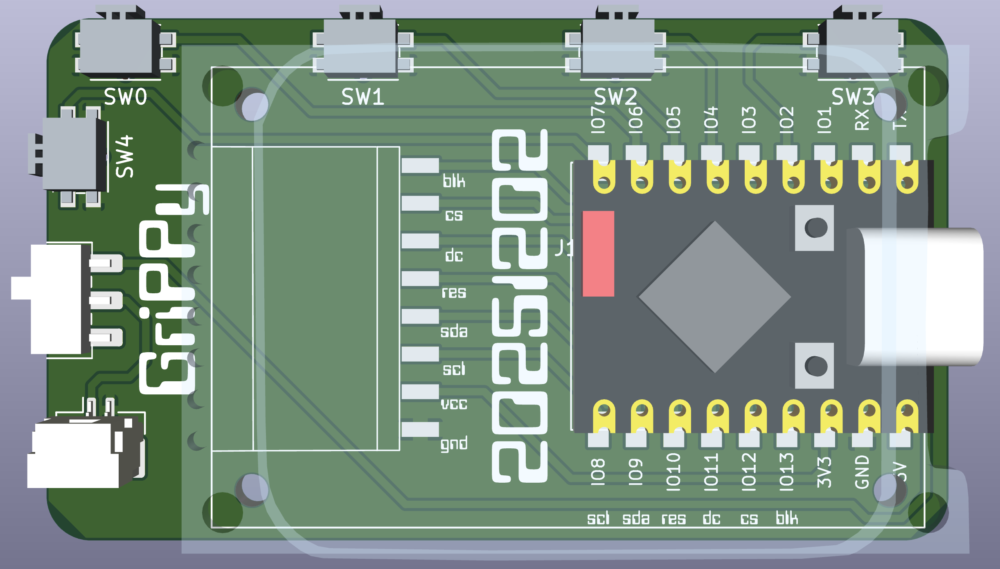

# Grippy – Ultracompact One-Handed Keyboard

## Overview

Started as a one-handed chording keyboard.
Five revs later: a slim, ultralight EDC note-taker.

Grippy also supports USB or BLE keyboard modes.

### Features

- **Slim & Lightweight**
  - About the thickness of a AAA battery  
  - ~7× lighter than an iPhone  

- **One-Handed SAIE Chording**
  - Full text entry: letters, numbers, symbols  
  - Three layers, zero finger travel  

- **EDC Note-Taking**
  - Write and review notes directly on the device  
  - Works even while pocketed  

- **USB Keyboard Mode**
  - USB HID for quick input or macros  

- **BLE Keyboard Mode**
  - Wireless typing to phones and computers  

- **USB Storage Mode**
  - Mounts as a flash drive to edit notes  

- **Open & Hackable**
  - KiCad, STEP, FreeCAD, and 3MF files  
  - CircuitPython 10.x firmware + chording config

## Specs

| Item        | Value                  |
| ----------- | ---------------------- |
| Dimensions  | 61 x 35 x 11 mm        |
| Weight      | 29 grams               |
| Firmware    | CircuitPython 10.x     |
| Controller  | ESP32-S3               |
| Construction| SMD components on PCB  |

---

## CircuitPython Setup

---

## BOM

## Bill of Materials

| Part                                                                                                  | Desc.                | Qty |
| ------------------------------------------------------------------------------------------------------ | -------------------- | --- |
| <a href="https://amzn.to/4idmH0o">ESP32-S3 SuperMini</a>                                              | dual-core 240MHz / 512KB SRAM / 4MB Flash   | 1   |
| <a href="https://amzn.to/484M9jT">1.69” TFT Display</a>                                               | ST7789 SPI           | 1   |
| <a href="https://www.digikey.com/en/products/detail/panasonic-electronic-components/EVQ-PUL02K/286340">Panasonic EVQ-PUL02K Tactile Switch</a> | — | 1 |
| <a href=https://amzn.to/48axBAR>Standoff</a> | M2 × 5 mm | 4   |
| <a href=https://amzn.to/44vQJXr>Screws</a>| M2 × 5 mm            | 8   |
| <a href=https://www.aliexpress.us/item/3256804992051151.html>Female SMD Header</a> | 8-pin                | 1   |
| <a href=https://www.aliexpress.us/item/3256807383526945.html>Rt Ang Male Header | 8-pin                | 1   |
| <a href=https://www.ebay.com/itm/357161444108>Small LiPo Battery | 130 mAh (JST-1.25)   | 1   |
| <a href="https://www.aliexpress.us/item/3256805695475806.html">Slide Switch</a>| MSTK-12c03 | 1   |

---

## PCB

---

## Stencil

---

## Schematic

