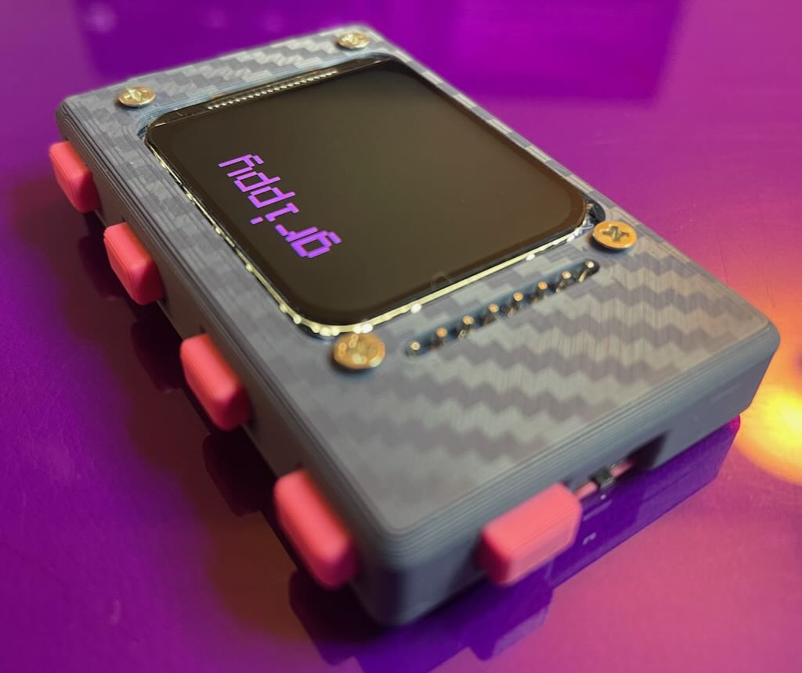
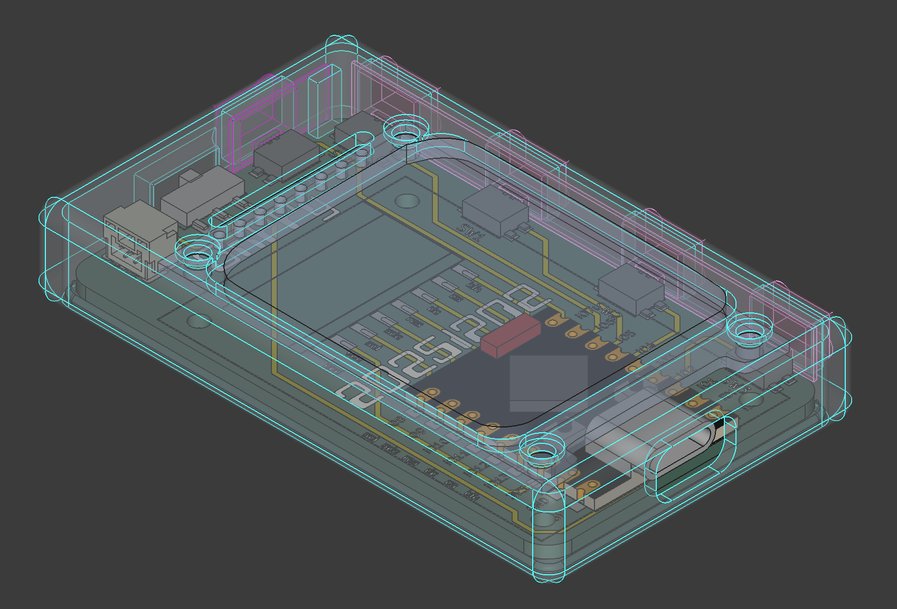
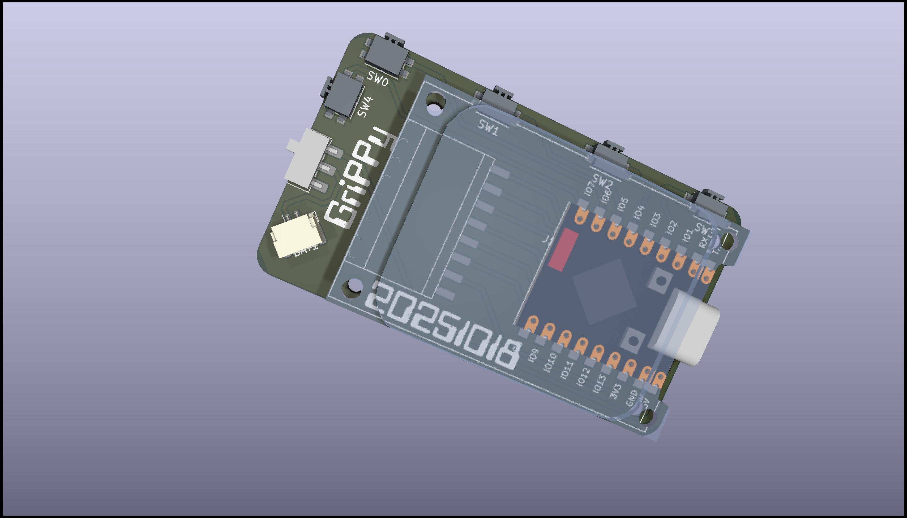
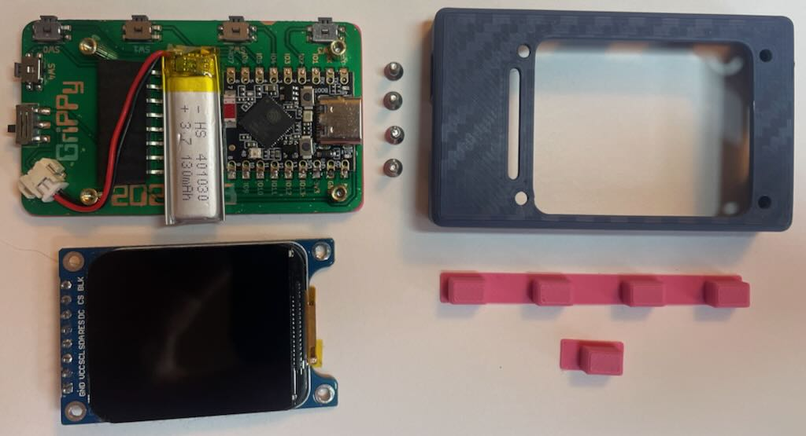

# Grippy – Ultracompact One-Handed “Grippy” Keyboard

## Overview

Grippy started as a one-handed pocket keyboard. Chords in, letters out.
Five full hardware redesigns later, it’s an slim, ultralight EDC note-taking machine. 

Grippy can also supports USB or BLE keyboard modes.

### Features

- **Slim & Lightweight**
  - Thickness of a AAA battery on its side
  - 7x less lighter than a typical iPhone

- **One-handed SAIE chording**
  - Enter letters, numbers, symbols, and whitespace via chords.
  - Three primary layers
  - No travel for thumb or fingers

- **Everyday carry note-taking**
  - Take notes while in the pocket
  - Note-taking directly on device (no external keyboard required).
  - Review notes on device

- **USB keyboard mode**
  - Acts as a USB HID keyboard when connected to a host.
  - Can be used for quick text entry or macro-style workflows.

- **BLE keyboard mode**
  - Can remotely connect to phones and computers over BLE

- **USB storage mode**
  - Mountable flash drive to modify notes

- **Open hardware / hackable**
  - KiCad and STEP files
  - FreeCAD and 3mF files
  - CircuitPython 10.x chord config, main app 

## Specs

| Item        | Value                  |
| ----------- | ---------------------- |
| Dimensions  | 61 x 35 x 11 mm        |
| Weight      | 29 grams               |
| Firmware    | CircuitPython 10.x     |
| Controller  | ESP32-S3               |
| Construction| SMD components on PCB  |

---

## CircuitPython Setup

---

## BOM

## Bill of Materials

| Part                                                                                                  | Length / Size        | Qty |
| ------------------------------------------------------------------------------------------------------ | -------------------- | --- |
| <a href="https://amzn.to/4idmH0o">ESP32-S3 SuperMini</a>                                              | —                    | 1   |
| <a href="https://amzn.to/484M9jT">1.69” TFT Display</a>                                               | —                    | 1   |
| <a href="https://www.digikey.com/en/products/detail/panasonic-electronic-components/EVQ-PUL02K/286340">Panasonic EVQ-PUL02K Tactile Switch</a> | — | 1 |
| <a href=https://amzn.to/48axBAR>Standoff</a> | M2 × 5 mm | 4   |
| <a href=https://amzn.to/44vQJXr>Screws</a>| M2 × 5 mm            | 8   |
| <a href=https://www.aliexpress.us/item/3256804992051151.html>Female SMD Header</a> | 8-pin                | 1   |
| <a href=https://www.aliexpress.us/item/3256807383526945.html>Rt Ang Male Header | 8-pin                | 1   |
| <a href=https://www.ebay.com/itm/357161444108>Small LiPo Battery | 130 mAh (JST-1.25)   | 1   |
| <a href="https://www.aliexpress.us/item/3256805695475806.html">Slide Switch</a>| MSTK-12c03 | 1   |

---

## PCB

---

## Stencil

---

## Schematic

